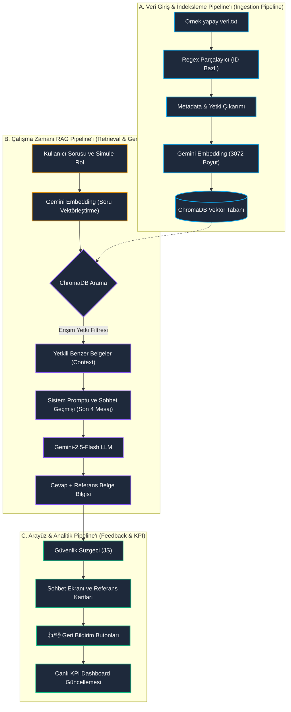

# 🚢 Karadeniz AI — Kurumsal Bilgi Asistanı Çalışma Rehberi

Bu döküman, Karadeniz Holding için geliştirilen RAG (Retrieval-Augmented Generation) tabanlı yapay zeka asistanının mimarisini, veri akışını, mevcut eksikliklerini ve gelecekte yapılabilecek geliştirmeleri baştan sona tüm detaylarıyla açıklamaktadır.

---

## 🏗️ 1. Sistem Mimarisi ve Bileşenler

Karadeniz AI, yerel verileri güvenli ve yetkilendirilmiş bir şekilde işleyen hafif (lightweight) ama gelişmiş bir teknoloji yığıtı üzerine kuruludur:

```
┌────────────────────────────────────────────────────────────────────────┐
│                              FRONTEND                                  │
│   HTML5 / CSS3 / Tailwind CSS / Javascript (Vanilla)                   │
│   - WebGL Canvas Shader Arka Planı (Dinamik parçacık animasyonu)       │
│   - Glassmorphic Arayüz Panelleri (Transparan tasarım)                │
│   - Sekme Yönetimi (Sohbet, Belge Kütüphanesi, Azure Bulut Planı)      │
└──────────────────────────────────┬─────────────────────────────────────┘
                                   │ Fetch API (HTTP POST / GET)
                                   ▼
┌────────────────────────────────────────────────────────────────────────┐
│                           BACKEND (FastAPI)                            │
│   `app_api.py`                                                         │
│   - API Uç Noktaları (Sohbet sorguları, Kütüphane listesi, Başlatma)  │
│   - Yetkilendirme / Erişim Denetimi Mantığı (Rol Eşleştirme)           │
└──────────────────────────────────┬─────────────────────────────────────┘
                                   │ LangChain Orkestrasyonu
                                   ▼
┌────────────────────────────────────────────────────────────────────────┐
│                           VERİ TABANI & AI                             │
│   ChromaDB (Vektör Tabanı) & Google Gemini API                         │
│   - `RateLimitedGeminiEmbeddings` (Ücretsiz API 100 RPM sınır koruyucu)│
│   - Gemini-2.5-Flash (LLM Cevap Üretici)                                │
│   - ChromaDB Singleton Client (SQLite kilitlenme önleyici)             │
└────────────────────────────────────────────────────────────────────────┘
```

---

## 🔄 2. Sistem Nasıl Çalışır? (Uçtan Uca Akış)

### Adım 1: Veri Tabanının Yüklenmesi ve İndekslenmesi (`database.py`)
1. **Veri Okuma:** `Ornek yapay veri.txt` dosyası satır satır okunur.
2. **Regex ile Ayrıştırma:** Dökümanlar `ID_PATTERN` (`İK-PR-01`, `BT-TA-02` vb.) kullanılarak bölümlere ayrılır.
3. **Öznitelik Çıkarma:**
   - **Departman:** ID önekinden otomatik tespit edilir (`İK` -> İnsan Kaynakları).
   - **Döküman Tipi:** ID ortasındaki koddan belirlenir (`PR` -> Prosedür, `TA` -> Talimat).
   - **Erişim Yetkisi:** Kapsam veya içerikte geçen anahtar kelimelere göre belirlenir. Güvenlik gereği `BT-PR-01` gibi kritik belgelere elle/özel kural ile `"BT Departmanı"` rolü atanır. Diğerleri varsayılan olarak `"Tüm Çalışanlar"` olur.
   - **Anahtar Kelimeler:** Eş anlamlı kelimeler haritası (örn: parola -> şifre) kullanılarak genişletilir.
4. **Vektörleştirme (Embedding):** Dökümanlar 25'erli gruplar halinde `models/gemini-embedding-2` modeline gönderilerek 3072 boyutlu vektörlere dönüştürülür. İstekler arasında rate-limit (429) yememek için 3 saniye duraklatılır.
5. **ChromaDB'ye Kayıt:** Vektörler ve döküman üstverileri (metadata) yerel SQLite tabanlı Chroma veritabanına yazılır.

### Adım 2: Arayüzden İstek Gönderilmesi (`index.html`)
1. Kullanıcı sol panelden simüle edeceği rolü seçer (örn: `Teknik Ekip`).
2. API Anahtarını girip Sistemi Başlat / Tabanı Yeniden Kur butonu ile backend'in hazır olmasını sağlar. (Burada simüle edilen yükleme barı kullanıcıya sürecin ilerleme durumunu gösterir).
3. Kullanıcı sorusunu yazar (örn: *"VPN'e nasıl bağlanırım?"*).
4. İstek `/api/chat` ucuna HTTP POST ile gönderilir. Gönderilen veriler: `api_key`, `query`, `simulated_role`, `temperature` ve `k`.

### Adım 3: Yetki Kontrolü ve Bilgi Getirme (RAG)
1. **Rol Kontrolü (`app_api.py`):** Kullanıcının rolüne göre erişebileceği yetki seviyeleri listelenir.
   - Örn: `Teknik Ekip` -> `["Tüm Çalışanlar", "Teknik Ekip"]` dökümanlarına erişebilir.
2. **Vektör Filtreleme (`chatbot.py`):** ChromaDB arama motoruna yetki filtresi eklenir:
   ```python
   search_kwargs["filter"] = {"Erisim_Yetkisi": {"$in": allowed_roles}}
   ```
   ChromaDB sadece bu yetki grubundaki en yakın `k` adet dökümanı getirir. Yetki dışındaki belgeler (örn: `BT Departmanı` yetkili belgeler) doğrudan veri tabanı seviyesinde elenir ve LLM'e asla gitmez.
3. **Model Cevabı:** Gelen belgeler sistem promptuna gömülerek Gemini modeline gönderilir. Model, dökümanlara dayanarak profesyonel bir yanıt üretir ve yanıtın sonuna referans aldığı dökümanların ID'lerini ekler.

### Adım 4: Güvenlik Süzgeci ve Gösterim (`index.html`)
1. Yanıt tarayıcıya döndüğünde, eğer bot *"yeterli bilgi bulunamadı"* veya *"yetkiniz yok"* gibi olumsuz bir dönüş yaptıysa, JavaScript süzgeci devreye girerek referans döküman kartlarının çizilmesini engeller (böylece kullanıcı yetkisi olmayan belgenin adını veya varlığını bile göremez).
2. Sohbet penceresi otomatik olarak yeni mesaja kaydırılır.


### 🛣️ 2.1. Uçtan Uca RAG Pipeline Akış Şeması

Aşağıdaki şema, sistemin arka planda dökümanları işleme, arama yapma ve kullanıcıya güvenli cevap döndürme sürecini baştan sona temsil etmektedir:



### Pipeline Bileşenlerinin Detaylı Açıklaması

1. **Veri Giriş (Ingestion) Aşaması:**
   * **Okuma:** Prosedür, politika, talimat ve formlardan oluşan 120 dökümanlık ham metin okunur.
   * **Ayrıştırma (Chunking):** Kod tabanındaki regex kuralları ile her döküman ID'si sınır kabul edilerek anlamsal birer parça (chunk) haline getirilir.
   * **Metadata Zenginleştirme:** Dökümanların departmanı, erişim yetkisi seviyesi ve eş anlamlı anahtar kelimeleri otomatik tespit edilerek üstverilerine yazılır.
   * **Vektörleştirme (Embedding):** Gemini modelinden geçen parçalar 3072 boyutlu anlamsal vektör dizisi olarak **ChromaDB**'ye kaydedilir.

2. **Bilgi Getirme (Retrieval) Aşaması:**
   * Kullanıcı sorusu anlık olarak vektörleştirilir.
   * ChromaDB, sorunun vektörü ile dökümanların vektörleri arasındaki kosinüs benzerliğini hesaplar.
   * **Yetki Koruması:** Kullanıcının seçtiği simüle rol dışındaki yetkisiz belgeler vektör tabanında doğrudan filtrelenerek LLM'e gönderilecek veri setinin dışında bırakılır.

3. **Cevap Üretim (Generation) Aşaması:**
   * Filtrelenmiş en yakın 3 döküman (bağlam/context), sistem promptu ve tarayıcıdan gelen **son 4 mesajlık sohbet geçmişi (Conversation Memory)** bir araya getirilerek tek bir komut şablonu oluşturulur.
   * Gemini-2.5-Flash modeli, sadece bu dökümanlardaki bilgilere sadık kalarak kurumsal, net ve doğru bir yanıt üretir.

4. **Sunum ve Analitik (Output & KPI) Aşaması:**
   * **Güvenlik Süzgeci:** Arayüzdeki Javascript kontrolü, botun *"yetkiniz yok"* veya *"bilgi bulunamadı"* cevabı vermesi durumunda döküman referans kartlarını gizler.
   * **Geri Bildirim Döngüsü:** Kullanıcının verdiği her 👍/👎 oy, oturum bazlı KPI metriklerini (Zaman Tasarrufu, Önlenen Bilet, Yanıt Başarı Oranı) gerçek zamanlı olarak günceller ve arayüzdeki dashboard'a yansıtır.

---

## 🔍 3. Gemini Embedding ve ChromaDB Derinlemesine İnceleme

Sistemimizin anlamsal arama (semantic search) yapabilmesi ve belgeleri saniyeler içinde bulabilmesi, **Gemini Embedding** ve **ChromaDB** bileşenlerinin birlikte çalışması sayesinde gerçekleşir.

### A. Gemini Embedding (`models/gemini-embedding-2`) Nedir ve Ne İşe Yarar?

Bilgisayarlar ve yapay zeka modelleri kelimelerin veya cümlelerin anlamlarını doğrudan "anlamaz". Kelimeleri sadece harf dizileri olarak görürler. Bu problemi çözmek için **Embedding (Vektörleştirme)** modelleri kullanılır.

1. **Vektörel Koordinata Dönüştürme:** `gemini-embedding-2` modeli, verdiğimiz her döküman metnini veya kullanıcının sorduğu soruyu analiz ederek onu **3072 adet sayısal değerden oluşan çok boyutlu bir koordinata (vektöre)** dönüştürür.
2. **Anlamsal Yakınlık:** Bu koordinat sistemi sıradan sayılar değildir; dil bilgisi ve anlamsal ilişkileri temsil eder. 
   - Örneğin; geleneksel kelime aramalarında (örn. SQL `LIKE` veya basit anahtar kelime eşleştirme) kullanıcının sorduğu **"parola"** kelimesi ile dökümanda geçen **"şifre"** kelimesi eşleşmediği için sonuç bulunamaz.
   - Ancak `gemini-embedding-2` modeli bu iki kelimenin anlamsal olarak çok yakın olduğunu bildiği için, bu kelimelere uzayda birbirine **çok yakın koordinatlar** atar. Böylece bot, kelimeler birebir aynı olmasa bile anlamca ilişkili olan doğru dökümanları (örn. `BT-PR-04: Erişim Yetkilendirme ve Şifre Güvenliği Prosedürü`) bulup getirebilir.

---

### B. ChromaDB Vektör Veritabanı Nasıl Çalışır? (Adım Adım)

ChromaDB, bu üretilen 3072 boyutlu anlamsal vektörleri ve bunlara ait orijinal metinleri/meta-verileri saklayan hafif, hızlı ve yerel çalışan bir **vektör veritabanıdır**. Süreç adım adım şöyle işler:

1. **Dökümanların Vektörleştirilerek İndekslenmesi (Yazma Aşaması):**
   - Prosedür veya politikalar (`Ornek yapay veri.txt` içindekiler) backend tarafından parçalara bölünür.
   - Her bir parça `gemini-embedding-2` modeline gönderilir ve anlam vektörü alınır.
   - ChromaDB; **[Döküman Metni + Meta-veri (Yetki, ID vb.) + Anlam Vektörü]** üçlüsünü eşleştirerek yerel diskteki SQLite tabanına yazar ve çok boyutlu bir arama ağacı (indeks) oluşturur.

2. **Kullanıcı Sorgusunun Arama Süreci (Sorgulama Aşaması):**
   - Kullanıcı bota bir soru sorduğunda (örn: *"Uzaktan çalışırken sisteme nasıl girerim?"*), backend bu soruyu da anlık olarak `gemini-embedding-2` modeline göndererek **sorunun anlam vektörünü** elde eder.
   - ChromaDB, sorunun vektörü ile veritabanında kayıtlı olan 120 dökümanın vektörleri arasındaki açıyı (**Kosinüs Benzerliği - Cosine Similarity**) matematiksel olarak hesaplar.
   - Birbirine en yakın (açısal olarak en benzer) olan dökümanları tespit eder.

3. **Yetki Bazlı Filtreleme (Güvenlik Aşaması):**
   - Arama işlemi sırasında ChromaDB, kullanıcının rol yetkisine uymayan dökümanları üstveri (metadata) filtresi (`Erisim_Yetkisi`) sayesinde doğrudan eler.
   - Yetkisi doğrulanmış ve soruyla en alakalı en yakın `k` (varsayılan: 3) adet dökümanı bularak LLM'e (Gemini-2.5-Flash) bağlam (context) olarak iletir.

---

## ⚠️ 4. Mevcut Eksiklikler (Güvenlik ve Performans Zayıflıkları)

Projenin mevcut yapısı yerel prototip seviyesindedir. Canlı (Production) ortama alınması durumunda şu eksiklikler bulunmaktadır:

1. **Güvenli Kimlik Doğrulama Eksikliği:** Kullanıcı sol paneldeki rolü manuel olarak değiştirebilmektedir. Bu durum jüri sunumu / simülasyonu için harikadır fakat gerçek hayatta veri sızıntılarına yol açar.
2. **Girişlerin Şifrelenmemesi (API Key):** Gemini API anahtarı tarayıcı tarafında `localStorage` üzerinde düz metin olarak saklanmakta ve her istekte backend'e gönderilmektedir. Bu, API anahtarının çalınma riskini artırır.
3. **Kalıcı Oturum Depolama (Long-term Memory) Eksikliği:** Projede konuşma akıcılığı için son 4 mesajlık kısa süreli hafıza (Short-term memory) aktiftir. Ancak oturum sonlandığında veya sayfa yenilendiğinde bu geçmiş silinir; kalıcı bir geçmiş depolaması yoktur.
4. **Statik/Elle Yetki Ataması:** Dökümanların yetki seviyeleri dosya içeriğindeki kelimelerden regex ile tahmin edilmektedir. Dosyada ufacık bir yazım hatası yapılması, gizli bir belgenin tüm çalışanlara açılmasına yol açabilir.
5. **Senkron Cevap Süresi:** Backend, cevabın tamamı üretilene kadar bekler. Bu durum, uzun cevaplarda kullanıcının 3-5 saniye boyunca boş ekrana bakmasına yol açar.

---

## 🚀 5. Neler Eklenebilir? (Gelecek Yol Haritası)

Projeyi kurumsal standartlara taşımak için aşağıdaki iyileştirmelerin yapılması önerilir:

### A. Altyapı ve Güvenlik
- **Microsoft Entra ID (Azure AD) Entegrasyonu:** Kullanıcı yetkileri dropdown listesinden manuel seçilmek yerine, kullanıcının holding bilgisayarı oturumundan otomatik çekilmelidir.
- **Güvenli API Ağ Geçidi (Secret Manager):** Gemini API anahtarı kullanıcılardan alınmamalıdır. Backend tarafında Azure Key Vault içinde saklanmalı ve tüm işlemler backend üzerinden yetkilendirilmiş API anahtarlarıyla yapılmalıdır.
- **Rol Tabanlı Belge Yönetimi (JSON Sidecar):** Her belgenin izinleri yazılım kodunda (`database.py`) değil, dökümanların yanında birer meta-veri dosyası (örn: `.meta.json`) olarak tutulmalıdır.

### B. Yapay Zeka ve RAG İyileştirmeleri
- **Cevap Akışı (Streaming):** Server-Sent Events (SSE) kullanılarak, botun cevabı harf harf akıtılmalı (chatgpt gibi). Bu, kullanıcının bekleme deneyimini iyileştirir.
- **Uzun Süreli Hafıza Deposu:** Sohbet geçmişini Redis veya PostgreSQL gibi kalıcı bir veritabanında saklayarak kullanıcının geçmiş konuşmalarına gün sonra bile ulaşabilmesi sağlanmalıdır.
- **Hibrit Arama (Hybrid Search):** Hem kelime tabanlı arama (BM25) hem vektörel arama birleştirilerek (RRF - Reciprocal Rank Fusion ile) arama doğruluğu %99 seviyesine çıkarılmalıdır.
- **Geri Bildirim Toplama ve RLHF:** Sistemde kurulu olan 👍/👎 mekanizmasından gelen veriler kalıcı veri tabanında toplanarak RAG performansını artıracak ince ayarlama (Fine-Tuning) veya RLHF süreçlerinde girdi olarak kullanılmalıdır.
